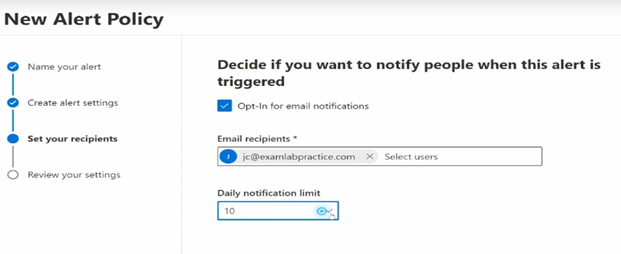
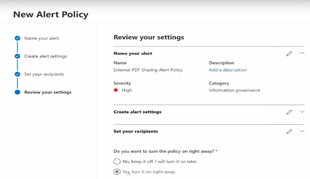
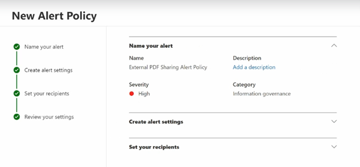

# Manage-and-Analyse-audit-logs-and-reports
 Create an alert policy for sharing of files externally. Set to high severity.

<h2>Description</h2>
Lab consists of a create Alert Policy by using Microsoft 365 Defender Portal. We can use alert policies and the alert dashboard in the Microsoft Purview compliance portal or the Microsoft 365 Defender portal to create alert policies and then view the alerts generated when users perform activities that match the conditions of an alert policy.	
<br />


<h2>Environments Used </h2>
- <b>Microsoft 365 Defender Portal </b>

<h2>Prerequisites</h2>

-<b> Password Lockout Settings modified by anyone assigned the following roles:
 - Security Administrator
 - Global Administrator
 </b>
- <b> Licenses:  Microsoft 365 Enterprise, Office 365 Enterprise, or Office 365 US Government E1/F1/G1, E3/F3/G3, or E5/G5 licences</b>

<h2>Program walk-through:</h2>

<h3>Steps: </h3>
1. Log in to Microsoft defender portal
2: Go to tab 'policies and ruels'
3: Click on 'alert policy' --> new alert policy
4: Name the policy, set severity as 'high' and set category as 'information governance' and click next
5: Set activity is 'Shared file externally' 
6: Turn on radio button as 'every time an activity matches the rule'
7: Click next and add Email recipient
8: Review the settings 
9: Done and the polict made.

<h3>Screenshots:</h3>

<p align="center">
Policies & Rules:  <br/>

<br />
<br />
New Alert Policy:  <br/>

<br />
<br />
Give a Name & Set Severity: <br/>

<br />
<br />
Alert Settings: <br/>

<br />
<br />
Add a Recipient: <br/>

<br />
<br />
Review Settings: <br/>

<br />
<br />
Result: <br/>

<br />
<br />


</p>

<!--
 ```diff
- text in red
+ text in green
! text in orange
# text in gray
@@ text in purple (and bold)@@
```
--!>
